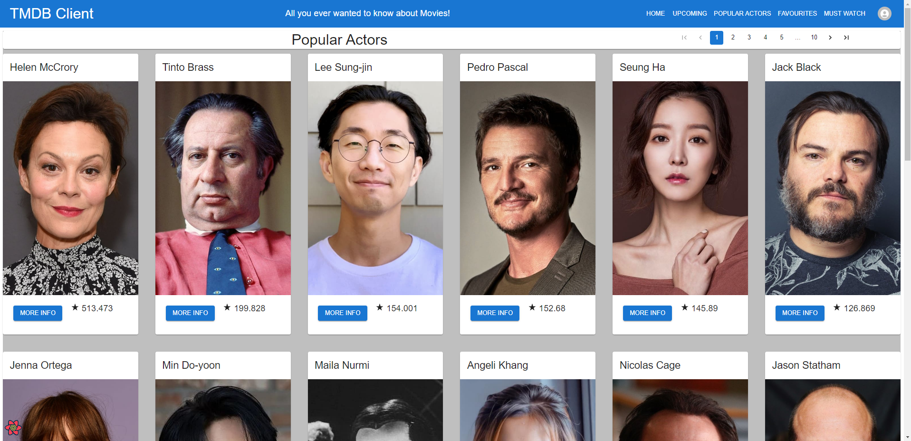
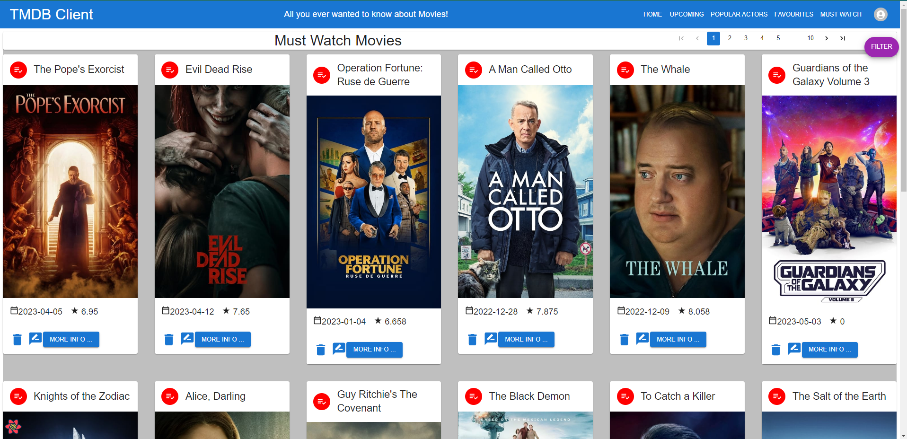
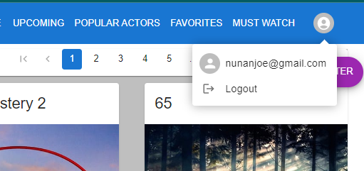

# Enterprise Web Development - Assignment 1.

__Name:__ Joe Nunan

## Overview.

[A bullet-point list of the features developed for the React SPA app (new/modified ones only for the Movies app),]

+ Popular Actors Page
+ Actor Details Page
+ Filmography component embedded in Actors Details page including complex interaction cards
+ Filmography includes combined credits for both Movies and TV
+ Enhanced Filter - enhanced existing filter to include year picker 
+ Moved location of Filter drawer as blocking filtered results
+ Filter available on Home page, Upcoming Movies page, Favourites page and Watch List page
+ Added Pagination for Homepage, Upcoming Movies, Favourites page, Must Watch Page and Popular Actors page
+ Altered most of headers on sites to remove forward and back arrow icons and replace with @MUI Pagination
+ Added must Watch List page with similar features to favourites page
+ Added Supabase authentication. Created login page for email and username. Autheticate against Supabase Users table.
+ Added logout facility
+ Added Authenticate routes for several parts of site
+ Added Vercel Delpoyment of application on for each github push

+ Refactored all movie cards to have action area on image which deep links to movie details. Also refactored formatting of 'More Info..' button.
+ etc.
---------------------------------------------------------------------
## Feature Design.
---------------------------------------------------------------------
[ For each feature listed in the overview, show a screenshot(s) of its UI layout (use appropriate magnification for accessibility). Include captions with the images.]
---------------------------------------------------------------------
### Popular Actors and Details Sections
---------------------------------------------------------------------
Additional actor specific API calls in tmdb-api.js
Components:
+   actorCard
+   ActorDetails
+   actorList
+   headerActor
+   templateActorPage
+   templateActorsListPage
+   actorFilmography
+   actorFilmCard

Actors Pages:
+   actorDetailsPage.jsx
+   popularActors.jsx

Actors Routing:
+   Added additional routes in src/index.jsx for actors pages (Actors Details authenticated route)
```JavaScript
    <Route element={<AuthRoute />}>
        ...
      <Route path="/actors/profile/:id" element={<ActorDetailsPage/>} /> 
        ...
    </Route>         
    <Route path="/actors/popular" element={<PopularActorsPage/>} />  
```

Actor Details page includes biography of Actor, photos of actor, and filmography section showing films and movies they are known for. Created actorFilmCard component for displaying actors. This includes CardActionArea which links to Actor Details screen. Navigation to Actor Details screen can also be carried out through More Info button. Actors Details screen is protected route so user needs to be logged in to access.

The filmography section includes film cards that have complex interaction (found this ability in MUI documentation). 
+   Clicking on chevron at bottom expands card to show overview. 
+   Click on image links to movie details page to see film details. 
+   Used <CardActionArea> combined with <Link> to allow user click on image of film on moviecard to go to movies details page.

Filmography includes combined credits i.e. films and tv shows actor has starred in. Had to add some additional logic for displaying titles as different field names used for movies and TV series in TMDB API. The actorFilmography and actorFilmCard components were added to facilitate displaying the combined credit results.

> New Popular Actors page. Multipage pagination, new Actor card components. Picture has CardActionArea, so user can either click picture or 'More Info' button to get to Actor Details Screen.



> New Actors Details page. Displays Actor Biography, Chip labels with key pieces of information such as place of birth, photos of actor and filmography section.


> FilmCard in Filography section includes complex interaction. Picture is link to film details. Film can be added to favourites using icon. Chevron on right hand side can be clicked to display film details at bottom of card.


> Following shows expanded film description and favourite icon selected.


---------------------------------------------------------------------
### Enhanced Filter
---------------------------------------------------------------------
Added Enhaced filter on Home screen to allow filter by year. For this made changes on 
Pages:
+   homepage.jsx

Components:
+   movieFilterUI
+   filterMoviesCard

Incorporated @mui/x-date-pickers from MUI and set to year only date picker.
Had to install following to make work...

+ npm install @mui/material @emotion/react @emotion/styled
+ npm install dayjs --save

Had to add additional function called handleDateChange in the filterMoviesCard component. Datepicker sends value of datepicker instead of event object. This led to errors when the original handleInputUser function called e.preventDefaults(); 

Additionally I used substring function to extract year from universal timestamp value the date picker returns.

I also moved the Drawer component to right hand side of screen instead of left because when movies filtered down to one  or two, they were hidden behind the drawer.

> Following shows the new filter by year option unfilled, including 'Clear' button at bottom to reset date


> Same screen with 2021 selected for the year showing filtered results in background.


---------------------------------------------------------------------
### Pagination
---------------------------------------------------------------------

Added pagination to home pages, upcoming movies and popular actors pages. Used @tanstack/react-query and refactored all queries using standard react-query so queryClient and queryClientProvider could be shared across all pages from root level. The refactoring included pages that did not have pagination but used react-query functions. 

The pagination function implemented with @tanstack/react-query includes prefetch functionaility to allow data to be continually displayed on screen while next page data is being retrieved.

Changing over to @tanstack/react-query broke favourites page so had to refactor section of code to make work again (around useQueries and mapping section). 

Pagination added in headerMovieList/index.jsx which is reused across Homepage, Upcoming Movies, Popular Actors and Favourites pages. Having like this avoids repetition of code. 

Refactored code in headerMovieList to remove back and forward arrow icons since @MUI pagination being used to provide navigation back and forth between pages. Added Grid to header to allow for better formatting and positioning of content. 

> Pagination added for multiple pages by adding to site header to eliminate duplication of code.


---------------------------------------------------------------------
### Must Watch page
---------------------------------------------------------------------

Setup a Must Watch page where users can see movies on their must watch list. Movies can be added to must watch list in upcoming movies page. Setup following elements for this functionality.

Pages:
+ watchListPage.jsx

Components:
+ cardIcons/removeFromMustWatch

Contexts:
+ contexts/moviesContext.jsx 

Added following pages to authenticated routes (Must Watch on authenticated route):
```JavaScript
    <Route element={<AuthRoute />}>
        ...
        <Route path="/movies/watchlist" element={<WatchlistMoviesPage />} />
        ...
    </Route>
```

All other components were reused from other sections of the application. In the movieContext.jsx added function to remove movie from must watch list. 

Access to Must Watch page is through protected route so user must be authenticated to access it. The page is based on favourites page and reuses elements of it. Hence Filter functionality, pagination, ability to remove movie from watchlist, ability to create review on movie and deep link to Movies details page are all available.

> Must Watch page where autheticated users can view movies they have added to their Must Watch list on Upcoming Movies page



---------------------------------------------------------------------
## Authentication
---------------------------------------------------------------------

### Protected Routes and Features
---------------------------------------------------------------------

The following shows a list of all routes in the application. 

```JavaScript
            <Routes>
              {/* Items within the AuthRoute route element require authentication to access  */}
              <Route element={<AuthRoute />}>
                <Route path="/movies/favourites" element={<FavouriteMoviesPage />} />
                <Route path="/movies/watchlist" element={<WatchlistMoviesPage />} />
                <Route path="/actors/profile/:id" element={<ActorDetailsPage />} />
                <Route path="/reviews/form" element={<AddMovieReviewPage />} />
                <Route path="/reviews/:id" element={<MovieReviewPage />} />
              </Route>
              {/* Following routes do not require authentication. */}
              <Route path="/register" element={<Register />} />
              <Route path="/login" element={<Login />} />
              <Route path="/actors/popular" element={<PopularActorsPage />} />
              <Route path="/movies/upcoming" element={<UpcomingMovies />} />
              <Route path="/movies/:id" element={<MoviePage />} />
              <Route path="/" element={<HomePage />} />
              <Route path="*" element={<Navigate to="/" />} />
            </Routes>
```

The protected features within the application that require a user to be logged in are:
+ Favourites
+ Must Watch
+ Opening full reviews for movie from review drawer
+ Accessing Actor Details page from Popular Actors page
+ Adding user review

---------------------------------------------------------------------
### Supabase for Authentication
---------------------------------------------------------------------
Added authentication with Supabase. Created new AuthContext context containing 'AuthProvider' context provider. Wrapped all elements in index.js with this, including SIteHeader where authenication code is contained. AuthContext carries out email login verification against users table on the account. Added keys to .env file and created supabase/client.js to create client instance that can be used across the application. 

```JavaScript
<QueryClientProvider client={queryClient}>
      <BrowserRouter>
        <AuthProvider>
          <SiteHeader />      {/* New Header  */}
          <MoviesContextProvider>
            <Routes>
             ...
            </Routes>
          </MoviesContextProvider>
        </AuthProvider>
      </BrowserRouter>
      <ReactQueryDevtools initialIsOpen={false} />
    </QueryClientProvider>
```


Created custom login page using Card, FormControl, Grid and Link elements. Also had links in place for forgotten password and Registration but ran out of time to implement these features. For email text field added email icon and for password field added option to display field contents. 

> Login page for application features which require authenitcation to access.


Pages:
+   login.jsx

Components:
+   authRoute
+   profileIcon

Contexts:
+   authProvider

Supabase:
+   client.js

Added following pages to authenticated routes:
```JavaScript
    <Route element={<AuthRoute />}>
        <Route path="/homeauth" element={<Home />} />
        <Route path="/movies/favourites" element={<FavouriteMoviesPage />} />
        <Route path="/actors/profile/:id" element={<ActorDetailsPage />} />
        <Route path="/reviews/form" element={<AddMovieReviewPage />} />
        <Route path="/reviews/:id" element={<MovieReviewPage />} />
    </Route>
```

Added Sign In and Profile Icon menu items to siteheader. The menu toggles between displaying both dependent on whether user is logged in or not. When Profile Icon displayed, hovertip displays email address of logged in user and clicking on profile icon brings up context menu with option for logout.

> Sign In menu item displayed to user when not logged in.


> For users who are logged in, menu item changes to Profile Icon, which displays context menu once clicked on. Users use this to log out.



To handle the authentication of users, I set up a Supbase account and MyMoviesApp project on it. All test users are managed through teh Auth functionality in Supabase.

> Following shows screenshot of Users table in Supabase project setup for authentication of the application.


Added the VITE_SUPABASE_URL and VITE_SUPABASE_ANON_KEY keysin the .env file for localhost deployment and added to Environmental Variables for Vercel Deployment.

> Following screenshot login activity to my application over a 5.5 hour period. The graph at the top shows logs over time and on the right hand side you can see specifics of login user using nunanjoe@gmail.com email address.


---------------------------------------------------------------------
### Deployment Using Vercel
---------------------------------------------------------------------
Deployment of the application is handled using Vercel. To enable management of build and deploy of my app, I signed up for an account with Vercel and linked it to my movies app repository on GitHub. 

While I have been developing the application I have continually being pushing my code to Master branch instead of Main (error on my part as Main is now default bracnh on Git). This meant I needed to alter setting for my deployment ot point to Master instead of Main branch. 

The configuration settings which were required were.
+ General > Build & Deployment Settings > Framework Preset - Selected Vite
+ Git > Connected Git Repoisitory - Selected my labMoviesApp repository
+ Git > Production Branch - changed from Main to Master 
+ Environmental Variables - added VITE_SUPABASE_URL, VITE_SUPABASE_ANON_KEY and VITE_TMDB_KEY
+ All other settings were left with defaults

Each time I make a commit of my application and push to Git, Vercel automatically builds and Deploys the application. 

Access Details to my Vercel deployment of my application:
+ App URL:    https://lab-movies-app-psi.vercel.app/
+ Username:   msc.validation@joenunan.myapp
+ Password:   Ch3ck0utMyApp@

> Screenshot of deployment of my application using Vercel


> As can be seen below, application gets built and redeployed each time the code is committed and pushed to GitHub


====================================================================================================
e.g. 

#### The Upcoming Movies feature.

> Lists movies from the Upcoming movies endpoint of TMDB

![][image1]

#### Movies Reviews feature.
![][actorDetailsPage]

> Lists all the reviews for a particular movie (text extract only).

![][image2]

> Click the 'Full Review' link of an entry in the above list to show the full text of a review. 

![][image3]

.... other features .......

## Storybook.

[ Include a screenshot(s) from the Storybook UI and highlight the stories for new components developed.]

e.g.

![][image5]

## Authentication.

[ List all the routes in your app and highlight those that are protected/private (require authentication).]

e.g.

+ /movies - List of 20  movies from the Discover endpoint,
+ /movies/{movie_id} - Detailed information on a specific movie.
+ /reviews/{review_id} (Protected) - The full text of a movie review.
+ /movie/{movie_id}/similar - A list of similar movies. 
+ /person/{person_id} (Protected) - A specific actor's bio.
+ etc
+ etc

#### Protected features (if relevant)

[ Briefly state other areas where you used authentication in the app, for example, to protect access to functionality, e.g. only authenticated users can 'favourite' a movie.]

#### Supabase (if relevant)

[ Include a screenshot(s) from your Supabase account that verifies its use for this app. ]

## Deployment (if relevant).

[ Specify the URL of your deployed app and include a screenshot(s) from your deployment platform (e.g. Vercal) account that verifies its use for this app. Have a preregistered user for your app and specify their credentials.

Username: test1 ; Password: pass1
]

## Persistence (if relevant).

[ If you are persisting data to the Supabase backend, e.g. favourite movies, fantasy movie, include screenshots with appropriate captions to verify this aspect. ]

## Additional Information.

[ Briefly explain any other aspects of your app's design or implementation that is non-standard and worthy of mention.]

[image1]: ./images/image1.png
[image2]: ./images/image2.png
[image3]: ./images/image3.png
[image4]: ./images/image4.png
[image5]: ./images/image5.png