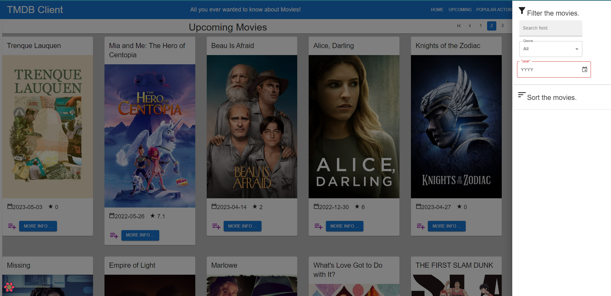

# Enterprise Web Development - Assignment 1.

__Name:__ Joe Nunan

## Overview.

[A bullet-point list of the features developed for the React SPA app (new/modified ones only for the Movies app),]

+ Popular Actors Page
+ Actor Details Page
+ Filmography component embedded in Actors Details page including complex interaction cards
+ Filmography includes combined credits for both Movies and TV
+ Enhanced Filter - enhanced existing filter to include year picker 
+ Moved location of Filter drawer as blocking filtered results
+ Filter available on Home page, Upcoming Movies page, Favourites page and Watch List page
+ Added Pagination for Homepage, Upcoming Movies, Favourites page, Must Watch Page and Popular Actors page
+ Added Supabase authentication. Created login page for email and username. Autheticate against Supabase Users table.
+ Added logout facility
+ Added Authenticate routes for several parts of site
+ Added must Watch List page with similar features to favourites page
+ Altered most of headers on sites to remove forward and back arrow icons and replace with @MUI Pagination
+ Added link to hompage of movies in detailed view
+ etc.

## Feature Design.

[ For each feature listed in the overview, show a screenshot(s) of its UI layout (use appropriate magnification for accessibility). Include captions with the images.]

#### Popular Actors and Details Sections
---------------------------------------------------------------------
Additional actor specific API calls in tmdb-api.js
Components:
+   actorCard
+   ActorDetails
+   actorList
+   headerActor
+   templateActorPage
+   templateActorsListPage
+   actorFilmography
+   actorFilmCard

Actors Pages:
+   actorDetailsPage.jsx
+   popularActors.jsx

Actors Routing:
+   Added additional routes in src/index.jsx for actors pages
+      <Route path="/actors/profile/:id" element={<ActorDetailsPage/>} />          
+      <Route path="/actors/popular" element={<PopularActorsPage/>} />  

Actor Details page includes biography of Actor, photos of actor, and filmography section showing films and movies they are known for. Created actoreFilmCard component for displaying actors. This includes CardActionArea which links to Actor Details screen. Navigation to Actor Details screen can also be carried out through More Info button. Actors Details screen is protected route so user needs to be logged in to access.

The filmography section includes film cards that have complex interaction (found this ability in MUI documentation). 
+   Clicking on chevron at bottom expands card to show overview. 
+   Click on image links to movie details page to see film details. 
+   Used <CardActionArea> combined with <Link> to allow user click on image of film on moviecard to go to movies details page.

Filmography includes combined credits i.e. films and tv shows actor has starred in. The actorFilmography and actorFilmCard components were added to facilitate this.

> New Popular Actors page. Multipage pagination, new Actor card components. Picture has CardActionArea, so user can either click picture or 'More Info' button to get to Actor Details Screen.

> New Actors Details page. Displays Actor Biography, Chip labels with key pieces of information such as place of birth, photos of actor and filmography section.

> FilmCard in Filography section includes complex interaction. Picture is link to film details. Film can be added to favourites using icon. Chevron on right hand side can be clicked to give filem details

> Following shows expanded film description and favourite icon selected.

---------------------------------------------------------------------

#### Enhanced Filter
---------------------------------------------------------------------
Added Enhaced filter on Home screen to allow fileter by year. For this made changes on 
Pages:
+   homepage.jsx

Components:
+   movieFilterUI
+   filterMoviesCard

Incorporated @mui/x-date-pickers from MUI and set to year only date picker.
Had to install following to make work...

+ npm install @mui/material @emotion/react @emotion/styled
+ npm install dayjs --save

Had to add additional function called handleDateChange in the filterMoviesCard component. Datepicker sends value of datepicker instead of event object. This led to errors when the original handleInputUser function called e.preverntDefaults(); 

Additionally I used substring function to extract year from universal timestamp value the date picker returns.

I also moved the Drawer component to right hand side of screen instead of left because when movies filtered down to one  or two, they were hidden behind the drawer.

> Following shows expanded film description and favourite icon selected.

> Same screen with 2019 selected for the year.

---------------------------------------------------------------------
#### Pagination
---------------------------------------------------------------------

Added pagination to home pages, upcoming movies and popular actors pages. Used @tanstack/react-query and refactored all queries using standard react-query so queryClient and queryClientProvider could be shared across all pages from root level. Pagination function implemented with @tanstack/react-query includes prefetch functionaility to allow data to be continually displayed on screen while next page data is being retrieved.

Changing over to @tanstack/react-query broke favourites page so had to refactor section of code to make work again (around useQueries and mapping section). 

Pagination added in headerMovieList/index.jsx which is reused across Homepage, Upcoming Movies, Popular Actors and Favourites pages. Having like this avoids repetition of code. 

Refactored code in headerMovieList to remove back and forward arrow icons since @MUI pagination being used to provide navigation back and forth between pages. Added Grid to header to allow for better formatting and positioning of content. 

> Pagination added for multiple pages by adding to site header to eliminate duplication of code.

---------------------------------------------------------------------
ester
e.g. 

#### The Upcoming Movies feature.

> Lists movies from the Upcoming movies endpoint of TMDB

![][image1]

#### Movies Reviews feature.
![][actorDetailsPage]

> Lists all the reviews for a particular movie (text extract only).

![][image2]

> Click the 'Full Review' link of an entry in the above list to show the full text of a review. 

![][image3]

.... other features .......

## Storybook.

[ Include a screenshot(s) from the Storybook UI and highlight the stories for new components developed.]

e.g.

![][image5]

## Authentication.

[ List all the routes in your app and highlight those that are protected/private (require authentication).]

e.g.

+ /movies - List of 20  movies from the Discover endpoint,
+ /movies/{movie_id} - Detailed information on a specific movie.
+ /reviews/{review_id} (Protected) - The full text of a movie review.
+ /movie/{movie_id}/similar - A list of similar movies. 
+ /person/{person_id} (Protected) - A specific actor's bio.
+ etc
+ etc

#### Protected features (if relevant)

[ Briefly state other areas where you used authentication in the app, for example, to protect access to functionality, e.g. only authenticated users can 'favourite' a movie.]

#### Supabase (if relevant)

[ Include a screenshot(s) from your Supabase account that verifies its use for this app. ]

## Deployment (if relevant).

[ Specify the URL of your deployed app and include a screenshot(s) from your deployment platform (e.g. Vercal) account that verifies its use for this app. Have a preregistered user for your app and specify their credentials.

Username: test1 ; Password: pass1
]

## Persistence (if relevant).

[ If you are persisting data to the Supabase backend, e.g. favourite movies, fantasy movie, include screenshots with appropriate captions to verify this aspect. ]

## Additional Information.

[ Briefly explain any other aspects of your app's design or implementation that is non-standard and worthy of mention.]

[image1]: ./images/image1.png
[image2]: ./images/image2.png
[image3]: ./images/image3.png
[image4]: ./images/image4.png
[image5]: ./images/image5.png